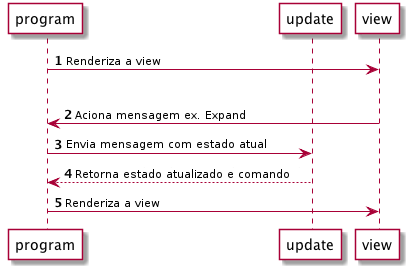

> Esta página cobre Elm 0,18

# Fluxo de aplicação

O diagrama a seguir ilustra como as partes do nossa aplicação interagem com o Html.program.

1. `Html.program` chama nossa função `view`com o modelo(model) inicial e renderiza.
1. Quando o usuário clica no botão Expandir, a `view` aciona a mensagem `Expand`.
1. `Html.program` recebe a mensagem `Expand` que chama nossa função `update` com `Expand` e o estado atual da aplicação.
1. A função `update` responde à mensagem retornando o estado atualizado e um comando para executar (ou `Cmd.none`).
1. `Html.program` recebe o estado atualizado, armazena-o e chama a `view` com o estado atualizado.

Geralmente o `Html.program` é o único lugar onde uma aplicação Elm mantém o estado, ele é centralizado em uma grande árvore de estados.
