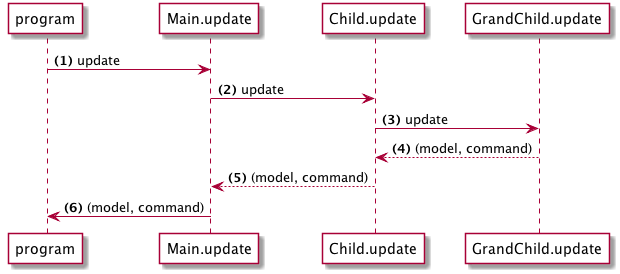

> Esta página cobre Elm 0,18

# Comandos (Cmd)

Em Elm, fazemos o uso de comandos (Cmd) para executarmos ações que envolvem efeitos colaterais em tempo de execução. Por exemplo:

- Gerar um número aleatório
- Fazer um pedido http
- Salvar algo no armazenamento local

O `Cmd` pode ser uma ou uma coleção de ações para executar. Usamos comandos para reunir todas as coisas que precisam acontecer e entregá-las ao ambiente de execução. Em seguida, o ambiente de execução irá executá-los e enviar os resultados de volta para o aplicativo.

Em outras palavras, toda função retorna um valor em uma linguagem funcional como Elm. Efeitos colaterais de funções no sentido tradicional são proibidos pelo design de linguagem e Elm usa uma abordagem alternativa para modelá-los. Essencialmente, uma função retorna um valor de comando que nomeia o efeito desejado. Devido à arquitetura Elm, o programa principal Html que estamos usando é o destinatário final desse valor de comando. O método `update` do Html.program contém a lógica para executar o comando nomeado.

Vamos tentar um aplicativo de exemplo usando comandos:

```elm
module Main exposing (..)

import Html exposing (Html, div, button, text, program)
import Html.Events exposing (onClick)
import Random


-- MODEL


type alias Model =
    Int


init : ( Model, Cmd Msg )
init =
    ( 1, Cmd.none )


-- MESSAGES


type Msg
    = Roll
    | OnResult Int


-- VIEW


view : Model -> Html Msg
view model =
    div []
        [ button [ onClick Roll ] [ text "Roll" ]
        , text (toString model)
        ]


-- UPDATE


update : Msg -> Model -> ( Model, Cmd Msg )
update msg model =
    case msg of
        Roll ->
            ( model, Random.generate OnResult (Random.int 1 6) )

        OnResult res ->
            ( res, Cmd.none )


-- MAIN


main : Program Never Model Msg
main =
    program
        { init = init
        , view = view
        , update = update
        , subscriptions = (always Sub.none)
        }
```

Se você executar este programa, ele mostrará um botão que gerará um número aleatório sempre que você clicar nele.

---

Vamos rever as partes relevantes:


### Mensagens (Msg)

```elm
type Msg
    = Roll
    | OnResult Int
```

Temos duas mensagens possíveis em nosso aplicativo. `Roll` para gerar um novo número. `OnResult` para obter um número gerado de volta da biblioteca `Random`.

### Atualizar (update)

```elm
update : Msg -> Model -> ( Model, Cmd Msg )
update msg model =
    case msg of
        Roll ->
            ( model, Random.generate➊ OnResult (Random.int 1 6) )

        OnResult res ->
            ( res, Cmd.none )
```

➊ `Random.generate` cria um comando que irá gerar números aleatórios. Esta função requer que o primeiro argumento seja um construtor para a mensagem que será retornada ao nosso aplicativo. Neste caso, nosso construtor é `OnResult`.

Então, quando o comando é executado, Elm irá chamar `OnResult` com o número gerado, produzindo `OnResult 2` por exemplo. Então __Html.program__ irá passar esta mensagem de volta ao aplicativo.

Caso você esteja se perguntando, `OnResult res` denota uma mensagem, OnResult, contendo dados adicionais, o Integer 'res' neste caso. Esse padrão é conhecido como tipos parametrizados.

---

Em um aplicativo maior com muitos componentes aninhados, podemos potencialmente enviar vários comandos de uma vez para o __Html.program__ . Tome este diagrama por exemplo:



Aqui nós coletamos comandos de três níveis diferentes. No final nós enviar todos estes comandos para que `program` possa executar.
