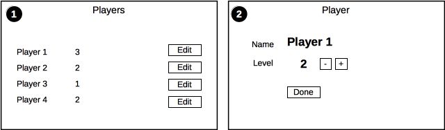

> Esta página cobre o Tutorial v2. Elm 0.18.

# Planejamento

Vamos construir uma aplicação básica para rastrear um RPG imaginário.

### Recursos

Durante o restante deste guia, usarei a palavra __resources__ para se referir a modelos que são os sujeitors de nossa aplicação. Estes são os __players__ nesta aplicação. Usar a palavra __model__ pode ser confuso porque o estado específico do componente também é um modelo (por exemplo, o estado expandido / recolhido de um componente).

## Wireframes

O aplicativo terá duas telas:

### Tela 1

Vai mostrar uma lista de jogadores. Daqui você pode:

- Editar um jogador

### Tela 2

Mostra a tela para editar um jogador. Nesta tela você pode:

- Alterar o nível

Esta é uma aplicação muito simples que demonstrará:

- Múltiplas telas
- Componentes aninhados
- Particionar o aplicativo em diversos recursos
- Roteamento
- Estado compartilhado na aplicação
- Ler e editar operação nos registros
- Chamadas Ajax
